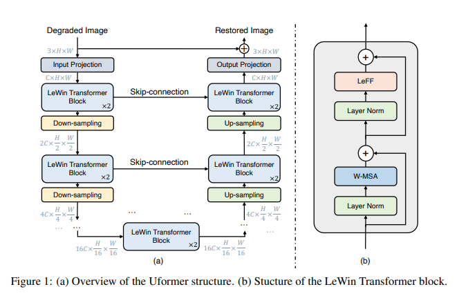

## Uformer - Pytorch

Implementation of <a href="https://arxiv.org/abs/2106.03106">Uformer</a>, Attention-based Unet, in Pytorch. It will only offer the concat-cross-skip connection.

This repository will be geared towards use in a project <a href="https://github.com/lucidrains/ddpm-proteins">for learning protein structures</a>. Specifically, it will include the ability to condition on time steps (needed for DDPM), as well as 2d relative positional encoding using rotary embeddings (instead of the bias on the attention matrix in the paper).

## Install

```bash
$ pip install uformer-pytorch
```

## Usage

```python
import torch
from uformer_pytorch import Uformer

model = Uformer(
    dim = 64,           # initial dimensions after input projection, which increases by 2x each stage
    stages = 4,         # number of stages
    num_blocks = 2,     # number of transformer blocks per stage
    window_size = 16,   # set window size (along one side) for which to do the attention within
    dim_head = 64,
    heads = 8,
    ff_mult = 4
)

x = torch.randn(1, 3, 256, 256)
pred = model(x) # (1, 3, 256, 256)
```

To condition on time for DDPM training

```python
import torch
from uformer_pytorch import Uformer

model = Uformer(
    dim = 64,
    stages = 4,
    num_blocks = 2,
    window_size = 16,
    dim_head = 64,
    heads = 8,
    ff_mult = 4,
    time_emb = True    # set this to true
)

x = torch.randn(1, 3, 256, 256)
time = torch.arange(1)
pred = model(x, time = time) # (1, 3, 256, 256)
```

## Citations

```bibtex
@misc{wang2021uformer,
    title   = {Uformer: A General U-Shaped Transformer for Image Restoration}, 
    author  = {Zhendong Wang and Xiaodong Cun and Jianmin Bao and Jianzhuang Liu},
    year    = {2021},
    eprint  = {2106.03106},
    archivePrefix = {arXiv},
    primaryClass = {cs.CV}
}
```
